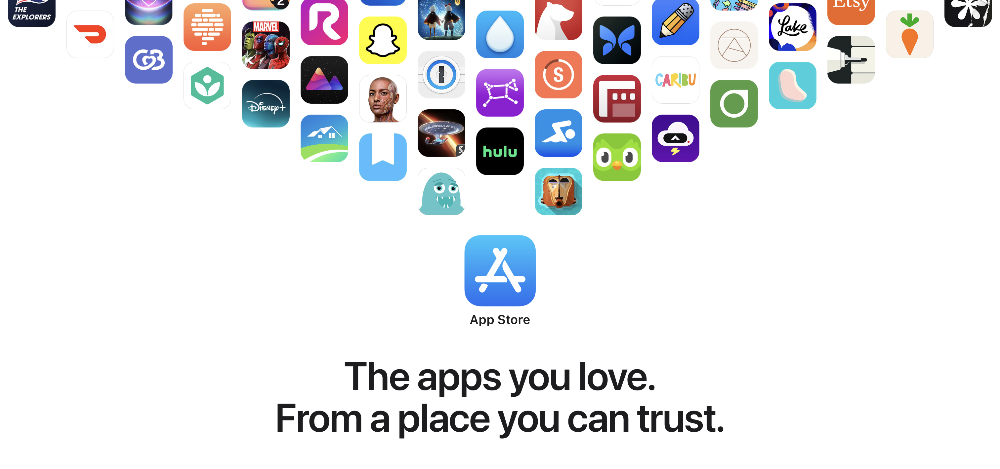

  

# Eine Bedrohungsanalyse von Sideloading  

## Wichtige Erkenntnisse  

- Die starke Privatsphäre und Sicherheit des iPhones ist entscheidend wegen der sensiblen persönlichen Daten, die es speichert.  
- Sideloading (Installation von Apps außerhalb des App Stores) stellt eine erhebliche Bedrohung für dieses Sicherheitsmodell dar.  
- Malware ist auf Plattformen, die Sideloading erlauben, deutlich weiter verbreitet (z. B. hat Android 15–47-mal mehr Infektionen als iOS).  
- Die Prüfprozesse des App Stores und die Systemschutzmaßnahmen verringern das Malware-Risiko erheblich.  

## Risiken von Sideloading  

- **Mehr Malware**: Sideloading umgeht die Prüfungen des App Stores und erlaubt Adware, Spyware, Trojaner usw.  
- **Soziale Manipulation**: Nutzer können dazu verleitet werden, gefälschte Apps zu installieren, die legitime imitieren.  
- **Weniger Kontrolle für Nutzer**: Sideloaded-Apps können Kindersicherungen, App Tracking Transparency oder Berechtigungsanfragen umgehen.  
- **Geschwächte Systemsicherheit**: Könnte erfordern, dass proprietäre APIs oder interne Bestandteile des Betriebssystems offengelegt werden, was die Kernarchitektur von iOS gefährdet.  
- **Negative externe Effekte**: Auch Nutzer, die kein Sideloading betreiben, sind gefährdet—z. B. durch Unternehmenszwang, gefälschte App Stores oder berufliche Anforderungen.  

## Beispiele für Malware  

- **Adware** (HiddenAds, CopyCat): Überschwemmt den Nutzer mit aggressiver oder betrügerischer Werbung.  
- **Ransomware** (CryCryptor, MalLocker.B): Verschlüsselt Gerätedaten und fordert Lösegeld.  
- **Spyware** (SpyNote, HelloSpy): Überwacht Aktivitäten, sammelt private Daten, wird zur Partnerüberwachung genutzt.  
- **Banktrojaner** (BlackRock, Anubis): Stiehlt Zugangsdaten durch Overlay-Angriffe, umgeht sogar 2FA.  

## Sicherheitsexperten raten  

> „Installieren Sie nur Apps aus offiziellen App Stores.“ — Europol  
> „Vermeiden Sie Sideloading auf BYOD-Geräten.“ — US-Heimatschutzministerium  
> „Apps von Drittanbietern stellen ein ernstes Sicherheitsrisiko dar.“ — Interpol/Kaspersky  

## Apples Haltung  

- Apple erlaubt bereits ein begrenztes Enterprise-Sideloading mit strikten Kontrollen.  
- Frühere Missbräuche (z. B. Facebook Research-App, Goontact-Spyware) zeigen, wie schnell diese Mechanismen ausgenutzt werden.  
- Weit verbreitetes Sideloading würde dieses Risiko erheblich verschärfen.  

## Fazit  

Sideloading bringt weitreichende Risiken für Nutzer, Entwickler und Organisationen mit sich. Apple betont, dass dadurch das Vertrauen in die Plattform sinken, die Angriffsflächen steigen und der Datenschutz für alle Nutzer geschwächt würde – nicht nur für diejenigen, die Sideloading betreiben.  

---  

## Originaldokumente  

- *Aufbau eines vertrauenswürdigen Ökosystems für Millionen von Apps* (Juni 2021)  
  -  [apple.com (offiziell)](https://www.apple.com/privacy/docs/Building_a_Trusted_Ecosystem_for_Millions_of_Apps.pdf)  
  -  [github.com/lucasditomase (Backup)](https://github.com/lucasditomase/app-restrictions/blob/main/summary.pdf)  

- *Eine Bedrohungsanalyse von Sideloading* (Oktober 2021)  
  -  [apple.com (offiziell)](https://www.apple.com/privacy/docs/Building_a_Trusted_Ecosystem_for_Millions_of_Apps_A_Threat_Analysis_of_Sideloading.pdf)  
  -  [github.com/lucasditomase (Backup)](https://github.com/lucasditomase/app-restrictions/blob/main/threat-analysis.pdf)  
