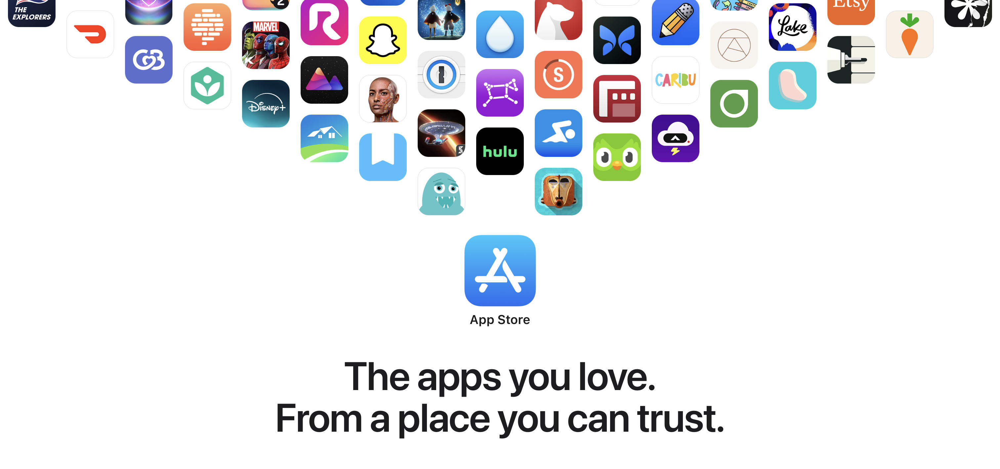

  

# การวิเคราะห์ภัยคุกคามจากการไซด์โหลด (Sideloading)  

## ข้อมูลสำคัญ  

- ความเป็นส่วนตัวและความปลอดภัยที่แข็งแกร่งของ iPhone มีความสำคัญอย่างยิ่ง เนื่องจากข้อมูลส่วนบุคคลที่เก็บไว้มีความอ่อนไหว  
- การไซด์โหลด (ติดตั้งแอปพลิเคชันนอก App Store) เป็นภัยคุกคามร้ายแรงต่อรูปแบบความปลอดภัยนี้  
- มัลแวร์แพร่หลายมากกว่าในแพลตฟอร์มที่รองรับการไซด์โหลด (เช่น Android มีการติดมัลแวร์มากกว่า iOS ถึง 15–47 เท่า)  
- กระบวนการตรวจสอบของ App Store และระบบป้องกันช่วยลดความเสี่ยงจากมัลแวร์ได้อย่างมาก  

## ความเสี่ยงจากการไซด์โหลด  

- **มัลแวร์เพิ่มขึ้น**: การไซด์โหลดข้ามกระบวนการตรวจสอบของ App Store ทำให้สามารถติดตั้ง adware, spyware, trojan ฯลฯ ได้  
- **วิศวกรรมสังคม**: ผู้ใช้สามารถถูกหลอกให้ติดตั้งแอปปลอมที่เลียนแบบแอปจริง  
- **การควบคุมของผู้ใช้น้อยลง**: แอปที่ไซด์โหลดอาจข้ามการควบคุมโดยผู้ปกครอง, ความโปร่งใสในการติดตามแอป หรือคำขออนุญาตต่าง ๆ  
- **ความปลอดภัยของแพลตฟอร์มอ่อนแอลง**: อาจต้องเปิดเผย API ส่วนตัวหรือโครงสร้างภายในของระบบปฏิบัติการ ซึ่งเป็นภัยต่อสถาปัตยกรรมความปลอดภัยหลักของ iOS  
- **ผลกระทบต่อผู้อื่น**: แม้ผู้ที่ไม่ใช้ไซด์โหลดก็ยังเสี่ยง เช่น ถูกบริษัทบังคับ, แอปสโตร์ปลอม หรือข้อกำหนดจากที่ทำงาน  

## ตัวอย่างมัลแวร์  

- **Adware** (HiddenAds, CopyCat): แสดงโฆษณารุนแรงหรือหลอกลวง  
- **Ransomware** (CryCryptor, MalLocker.B): เข้ารหัสข้อมูลในเครื่องและเรียกค่าไถ่  
- **Spyware** (SpyNote, HelloSpy): ตรวจสอบพฤติกรรม รวบรวมข้อมูลส่วนตัว ใช้สอดแนมคนใกล้ชิด  
- **Banking Trojans** (BlackRock, Anubis): ขโมยข้อมูลบัญชีผ่านการโจมตีแบบซ้อนหน้าจอ แม้กระทั่งเลี่ยง 2FA ได้  

## คำแนะนำจากผู้เชี่ยวชาญด้านความปลอดภัย  

> "ติดตั้งแอปจากร้านค้าแอปอย่างเป็นทางการเท่านั้น" — Europol  
> "หลีกเลี่ยงการไซด์โหลดในอุปกรณ์ BYOD" — กระทรวงความมั่นคงแห่งมาตุภูมิของสหรัฐฯ  
> "แอปจากบุคคลที่สามเป็นภัยคุกคามด้านความปลอดภัยที่ร้ายแรง" — Interpol / Kaspersky  

## จุดยืนของ Apple  

- Apple อนุญาตให้มีการไซด์โหลดแบบจำกัดสำหรับองค์กร โดยมีการควบคุมอย่างเข้มงวด  
- กรณีการใช้งานในทางที่ผิดในอดีต (เช่น แอป Facebook Research, สปายแวร์ Goontact) แสดงให้เห็นว่าระบบเหล่านี้สามารถถูกใช้ในทางที่ผิดได้รวดเร็วเพียงใด  
- หากมีการอนุญาตไซด์โหลดอย่างกว้างขวาง จะเพิ่มความเสี่ยงนี้อย่างมาก  

## สรุป  

การไซด์โหลดก่อให้เกิดความเสี่ยงในวงกว้างต่อผู้ใช้ นักพัฒนา และองค์กรต่าง ๆ Apple ระบุว่าสิ่งนี้จะทำลายความเชื่อมั่นในแพลตฟอร์ม เพิ่มช่องทางให้ถูกโจมตี และลดการคุ้มครองความเป็นส่วนตัวของผู้ใช้ทุกคน — ไม่ใช่แค่ผู้ที่เลือกไซด์โหลดเท่านั้น  

---  

## เอกสารต้นฉบับ  

- *การสร้างระบบนิเวศที่น่าเชื่อถือสำหรับแอปนับล้าน* (มิถุนายน 2021)  
  [apple.com (ทางการ)](https://www.apple.com/privacy/docs/Building_a_Trusted_Ecosystem_for_Millions_of_Apps.pdf)  
  [github.com/lucasditomase (สำรอง)](https://github.com/lucasditomase/app-restrictions/blob/main/summary.pdf)  

- *การวิเคราะห์ภัยคุกคามจากการไซด์โหลด* (ตุลาคม 2021)  
  [apple.com (ทางการ)](https://www.apple.com/privacy/docs/Building_a_Trusted_Ecosystem_for_Millions_of_Apps_A_Threat_Analysis_of_Sideloading.pdf)  
  [github.com/lucasditomase (สำรอง)](https://github.com/lucasditomase/app-restrictions/blob/main/threat-analysis.pdf)  
